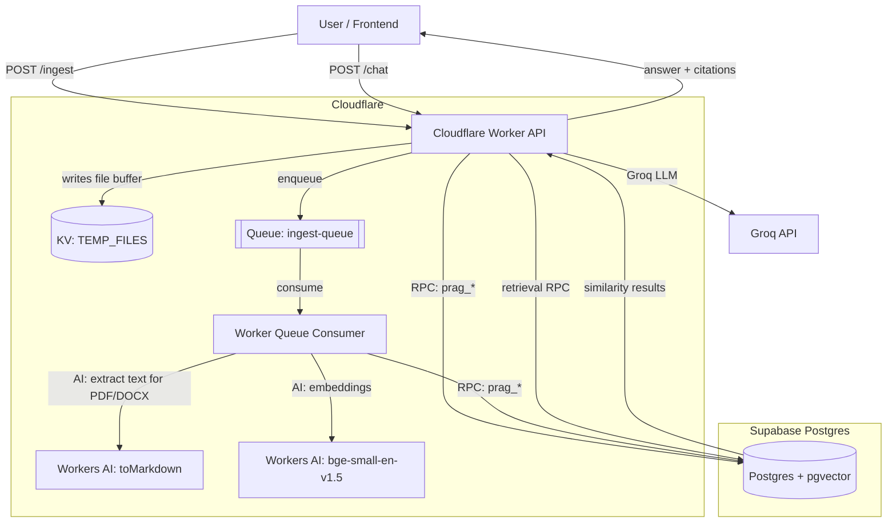
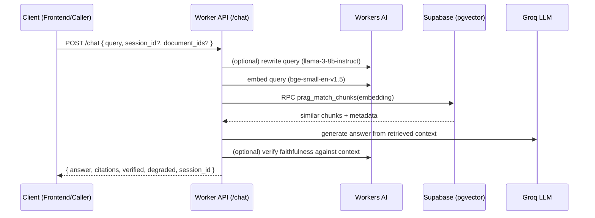

# PRAG — Production RAG on Cloudflare Workers + Supabase

PRAG is a **production-oriented Retrieval-Augmented Generation (RAG)** system designed to:

- **Ingest documents** (PDF/DOCX/TXT/Markdown)
- **Chunk + embed** them using **Cloudflare Workers AI**
- **Store vectors** in **Supabase Postgres (pgvector)**
- **Retrieve relevant chunks** via vector similarity search
- **Generate answers** with **Groq** (LLM) and **cite sources**
- Optionally **verify** answer faithfulness using an additional LLM pass (Cloudflare Workers AI)

This repository is a **pnpm workspace** containing:

- A **Cloudflare Worker** backend (API + queue consumer)
- A **React/Vite** frontend (optional UI)
- A **Supabase** database schema (migrations + RPCs)

---

## Table of contents

- [Architecture](#architecture)
- [Tech stack](#tech-stack)
- [Repository layout](#repository-layout)
- [Core concepts](#core-concepts)
- [API](#api)
- [Database schema & RPCs (Supabase)](#database-schema--rpcs-supabase)
- [Local development](#local-development)
- [Deployment](#deployment)
- [Operational practices](#operational-practices)
- [Troubleshooting](#troubleshooting)
- [Security notes](#security-notes)

---

## Architecture

### High-level view



### Request & data flow (RAG)



---

## Tech stack

### Backend

- **Runtime**: Cloudflare Workers (TypeScript, ESM)
- **HTTP + routing**: custom router in `src/app/routes.ts`
- **Observability**: `@sentry/cloudflare`
- **LLM (answer generation)**: **Groq** via `groq-sdk`
- **Embeddings + query rewrite + verification**: **Cloudflare Workers AI** binding (`AI`)
- **Async ingestion**: **Cloudflare Queues** + **Workers KV** for temporary file storage

### Database

- **Supabase Postgres**
- **pgvector** for storing embeddings (`extensions.vector(384)`) and similarity search
- Multi-schema layout: `knowledge`, `ingestion`, `agent`, plus `public` RPC functions

### Frontend (optional)

- React + Vite + TypeScript
- `react-markdown` + `remark-gfm`
- Sentry (`@sentry/react`)

---

## Repository layout

```text
.
├─ src/                      # Cloudflare Worker backend
│  ├─ index.ts               # Worker entry: fetch + queue consumer
│  ├─ app/
│  │  ├─ routes.ts           # HTTP endpoints: /ingest, /chat, /search, /answer, /health
│  │  └─ health.ts           # Health report builder
│  ├─ features/
│  │  ├─ ingestion/          # chunking + embeddings + DB writes
│  │  ├─ retrieval/          # query rewrite + embedding + vector search
│  │  ├─ agent/              # answer generation (Groq) + faithfulness verification
│  │  └─ chat/               # session orchestration (history -> answer)
│  ├─ infrastructure/
│  │  └─ supabase/           # Supabase client + repositories
│  └─ shared/                # chunking utilities, contracts, error types, trace IDs
├─ frontend/                 # React UI (Vite)
├─ supabase/                 # Supabase CLI config + migrations
├─ test/                     # Vitest
├─ wrangler.jsonc            # Worker configuration: AI binding, KV, queue
└─ package.json              # workspace scripts (wrangler, vitest, lint)
```

---

## Core concepts

### 1) Tenancy (single-tenant by default)

The backend writes every row with a `tenant_id`. In code this is currently sourced from a constant (`TENANT_ID`) and passed into Supabase RPC calls.

If you want multi-tenant support, you’d typically:

- Derive tenant ID from auth/JWT
- Enforce it via Postgres RLS
- Remove the hard-coded constant

### 2) Trace IDs and sessions

- `traceId` is used for end-to-end observability (Sentry + DB trace logs).
- `session_id` is a persistent identifier used to:
  - fetch recent chat history
  - scope retrieval (optional)
  - store messages and citations

The frontend stores `session_id` in `localStorage` and sends it on every `/chat` request.

### 3) Chunking strategy (RAG V3)

In ingestion (`src/features/ingestion/ingest-service.ts`):

- “Child chunks” are stable chunks (~300 tokens) used for retrieval
- Each chunk stores a **`parent_text`**: a sliding window of surrounding text (~1500-token window) so the LLM gets richer context even when retrieving small chunks

### 4) Faithfulness verification

After the answer is generated, PRAG can optionally verify whether the answer is supported by the retrieved context.

- If the Worker has an `AI` binding available, it runs a second pass (currently `@cf/meta/llama-3-8b-instruct`) to emit JSON:
  - `{"verdict":"supported"|"unsupported", ...}`
- If unsupported, the API marks the response as degraded.

---

## API

All endpoints are handled by `src/app/routes.ts`.

### `GET /health`

Returns a health report including:

- presence of key bindings/vars
- a DB healthcheck RPC result

Expected status codes:

- `200` if fully healthy
- `503` if any critical dependency is missing/unhealthy

### `POST /ingest`

Supports **three ingestion modes**:

1) **Multipart** (form upload)
2) **Raw binary** upload (frontend uses this)
3) **JSON** payload (`{title, content, metadata}`) for direct text ingestion

When uploading a file, the Worker:

- stores the file bytes in KV (`TEMP_FILES`) with a 1h TTL
- enqueues an `ingest-queue` job
- returns `202 Accepted` with a stable `document_id`
`

### `POST /chat`

Primary production endpoint.

Notes:

- `document_ids` scopes retrieval to a subset of documents.
- The returned `session_id` should be persisted by the client.

### `POST /search`

Low-level retrieval endpoint: embeds query and returns similar chunks.

### `POST /answer`

Low-level endpoint: search + Groq answer generation (no chat session management).

---

## Database schema & RPCs (Supabase)

The migration file `supabase/migrations/0001_intial_schema.sql` defines:

### Schemas (logical separation)

- `knowledge` — documents, chunks, chunk_vectors
- `ingestion` — ingestion job tracking
- `agent` — runs, citations, chat sessions/messages, trace logs

### Key tables

- `knowledge.documents`
- `knowledge.chunks` (includes `parent_text`, `page_number`, metadata)
- `knowledge.chunk_vectors` (pgvector `vector(384)`)
- `agent.chat_sessions` / `agent.chat_messages`
- `ingestion.jobs` / `knowledge.ingestion_jobs`

### Important RPCs

The Worker primarily uses RPC calls (from `ChunkRepository`) for DB writes and reads:

- `prag_insert_document`
- `prag_batch_insert_chunks`
- `prag_match_chunks`
- `prag_log_trace`
- `prag_start_ingestion_job` / `prag_finish_ingestion_job` / `prag_fail_ingestion_job`
- `prag_create_chat_session` / `prag_store_chat_message`
- `prag_get_chat_history`
- `prag_upsert_session` / `prag_append_session_message`
- `prag_healthcheck`

This pattern keeps the Worker “thin” and pushes constraints/logic into the database layer.

---

## Local development

### Prerequisites

- Node.js (recent LTS recommended)
- **pnpm** (workspace is managed via `pnpm-workspace.yaml`)
- Cloudflare Wrangler (`wrangler` is a dev dependency; use `pnpm wrangler ...`)
- Docker (only required if you run Supabase locally)
- Supabase CLI (present as a dev dependency)

### 1) Install dependencies

```bash
pnpm install
pnpm -C frontend install
```

### 2) Set up Supabase

You can use either:

#### Option A — Supabase hosted (recommended for quick start)

Create a Supabase project and apply migrations from `supabase/migrations/`.

You’ll need:

- `SUPABASE_URL`
- `SUPABASE_SECRET_KEY` (server/service role key)

#### Option B — Supabase local via CLI

From repo root:

```bash
pnpm supabase start
pnpm supabase db reset
```

This uses `supabase/config.toml`.

### 3) Configure Worker environment variables

The Worker requires:

- `SUPABASE_URL` (configured in `wrangler.jsonc` as a non-secret var)
- `SUPABASE_SECRET_KEY` (**Wrangler secret**)
- `GROQ_API_KEY` (**Wrangler secret**)
- `SENTRY_WORKER_DSN` (**Wrangler secret**, optional but recommended)

Set secrets:

```bash
pnpm wrangler secret put SUPABASE_SECRET_KEY
pnpm wrangler secret put GROQ_API_KEY
pnpm wrangler secret put SENTRY_WORKER_DSN
```

> Cloudflare Workers AI binding is configured in `wrangler.jsonc` as `AI`.

### 4) Run the Worker locally

```bash
pnpm dev
```

Local URLs (default wrangler):

- http://127.0.0.1:8787/health
- http://127.0.0.1:8787/chat
- http://127.0.0.1:8787/ingest

### 5) Run the frontend locally (optional)

```bash
pnpm -C frontend dev
```

Then open http://127.0.0.1:5173

> The current frontend code points to a deployed Worker URL in `frontend/src/lib/ingest.ts`.
> For local development, update the endpoint constants (or refactor to use `VITE_API_BASE_URL`).

### Tests

```bash
pnpm test
```

---

## Deployment

### Backend (Cloudflare Worker)

```bash
pnpm deploy
```

Wrangler config is in `wrangler.jsonc` and includes:

- Workers AI binding: `AI`
- KV namespace: `TEMP_FILES`
- Queue: `ingest-queue` (producer + consumer)

### Frontend (Cloudflare Pages / any static host)

```bash
pnpm -C frontend build
```

Deploy `frontend/dist`.

---

## Operational practices

### Observability

- **Sentry (Worker)** captures backend exceptions.
- DB trace events are written via `prag_log_trace`.
- The frontend also uses Sentry and tags requests with `session_id` and returned `traceId`.

### Architecture checks

This repo includes dependency-cruiser configuration.

```bash
pnpm arch:check
pnpm arch:graph
```

### Security / dependency hygiene

```bash
pnpm audit:health
pnpm audit:security
```

---

## Troubleshooting

### `/health` returns 503

Most common causes:

- missing `SUPABASE_SECRET_KEY`
- missing `GROQ_API_KEY`
- AI binding not available
- Supabase RPC `prag_healthcheck` failing (migrations not applied)

### Ingestion returns `202` but documents never appear

- Ensure the queue consumer is running (Wrangler dev runs queue handlers when configured)
- Ensure KV binding `TEMP_FILES` exists and is bound
- Check Worker logs for queue errors

### “Mismatched embedding count”

- Workers AI embedding model returned a shape not matching the batch size.
- Try smaller content or ensure Workers AI is healthy.

---

## Security notes

- `SUPABASE_SECRET_KEY` is a powerful server key. Store it only as a Wrangler secret.
- Consider enabling **RLS** and using per-user JWTs if exposing multi-tenant ingestion publicly.
- Restrict CORS origins in `src/index.ts` (`isAllowedOrigin`) before production.
